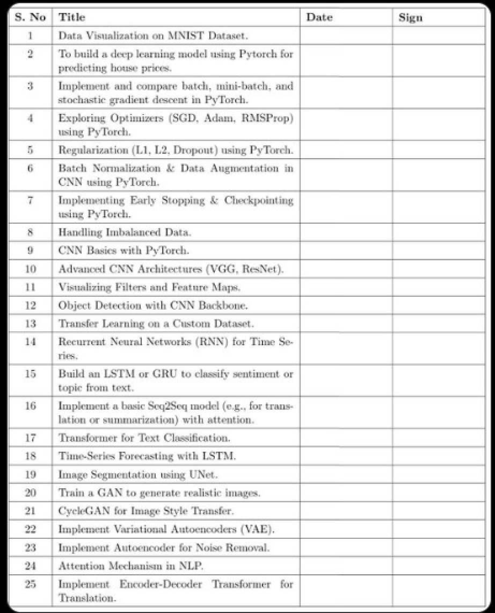

## 🧠 Machine Learning Projects

This repository contains my ongoing machine learning projects — from foundational algorithm implementations to applied experiments. It also tracks my progress through a structured deep learning roadmap based on PyTorch.

---

### 📁 Projects Included

#### 1. **LEGO Price Prediction (Applied ML)**

- Applied and evaluated multiple regression models to predict LEGO set prices using features like number of pieces, release year, and number of minifigures.
- Performed preprocessing using min-max scaling and log transformation.
- Used scikit-learn for training and visualized results.

#### 2. **Micrograd (Autograd from Scratch)**

- Implemented a minimal scalar-based autograd engine in Python.
- Supports computational graph creation and reverse-mode differentiation.
- Mimics core PyTorch functionality at a low level.

#### 3. **makemore – Part 1 (Bigram Language Model)**

- Implemented a character-level bigram model to generate names.
- Trained on a name dataset to learn character transitions.
- First part of a full deep learning series on text generation.

---

### 🧱 In Progress: Deep Learning Roadmap

I am currently working through a structured deep learning roadmap using PyTorch, covering key concepts like CNNs, RNNs, Transformers, GANs, and Autoencoders.

🖼️ Reference roadmap (25 checkpoints):

---

### 📌 Upcoming Projects

- CNN for MNIST visualization & classification
- Optimizer comparison (SGD, Adam, RMSProp)
- Image segmentation using UNet
- GAN and CycleGAN implementation
- Variational Autoencoders and Transformers for NLP
